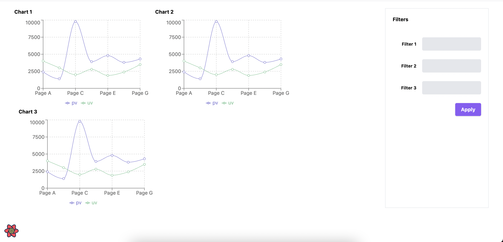

# How react query simplifies our polling, refetching requirements in just 10 lines

The simplified rough outline of UI looks like 



The UI gets generated with 
- An metadata api which fetches the list of charts metadata
- An analytics api to get the chart data which populates the chart (using Recharts).

So in the shown example we have three charts, which means we need to hit the analytics api three times for three charts. Here we have a limitation in the analytics api which doesn't support to accept multiple id's and gives all data in one shot.

## Now requirements

- Keep polling the analytics api for 10 times in an interval of 10 secs only when the api sends the status code as 429.
If status code is 200 then return data and for any other status code throw error. 
- If the user applies the filters (filters are one level nested objects) then the previous subscriptions should be cancelled and start a new poll.
- If user navigates to different tab/page all the polling operations should be stopped.
- This ChartCard component is used in multiple places with different polling interval requirements. So it should be configurable.

## Now the code

Well, this is not so complex but its tedious to write by ourselves. Now with react-query it's just 10 lines.

```tsx
const useFetchChartData = (params: Params) => {
  const handleRetry = React.useCallback(
        (failureCount: number, error: any) => {
            return params.retry
                ? params.retry(failureCount, error)
                : failureCount < 10 && error.statusCode === 429;
        },
        [retry]
    );

  return useQuery({
    queryKey: [params.id, params.filter],
    queryFn: () => api.post(...),
    retryDelay: params.retryDelay !== undefined ? retryDelay : 10_000,
    retry: handleRetry
    ...params.queryOptions
  });
}
```

**Things to note**,

- Now when the `filter` param data changes 
  - previous polling with old filters will be stopped.
  - react-query invokes the `queryFn` and updates the data if the status is 200.
  - If we get an error with status code 429 then `queryFn` gets invoked 10 times max with 10 sec interval in between requests. If all the attempts went for failure then `onError` callback will be called.

- When the calling component is unmounted then all subscriptions will be removed and polling will be stopped. For example,

```tsx
const ChartCard = () => {
  useFetchChartData(...)

  return <...>
}
```

If `ChartCard` is unmounted then react-query will remove all the subscriptions and stop polling.
